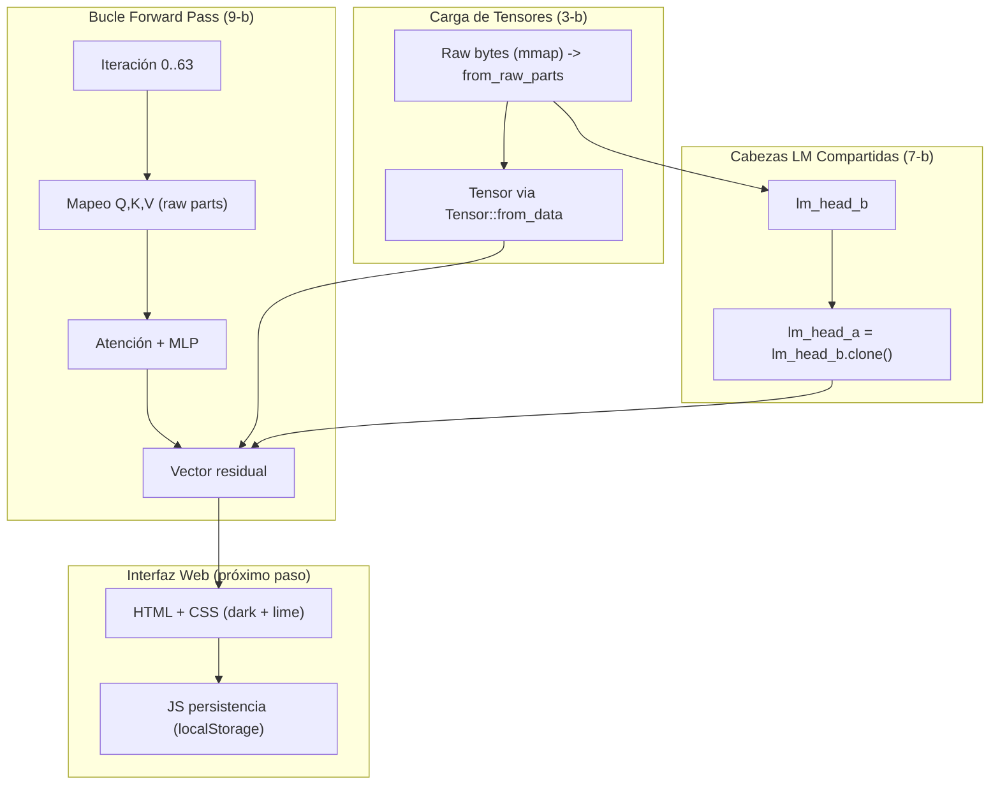

# Arquitectura del Proyecto Data‑X‑PHI

```mermaid
flowchart TD
    subgraph CargaDeTensores["Carga de Tensores (3‑b)"]
        A["Raw bytes (mmap) -> from_raw_parts"]
        B["Tensor<f32> via Tensor::from_data"]
        A --> B
    end

    subgraph CabezasLM["Cabezas LM Compartidas (7‑b)"]
        C["lm_head_b"]
        D["lm_head_a = lm_head_b.clone()"]
        C --> D
    end

    subgraph BucleForward["Bucle Forward Pass (9‑b)"]
        E["Iteración 0..63"]
        F["Mapeo Q,K,V (raw parts)"]
        G["Atención + MLP"]
        H["Vector residual"]
        E --> F --> G --> H
    end

    subgraph GUI["Interfaz Web (próximo paso)"]
        I["HTML + CSS (dark + lime)" ]
        J["JS persistencia (localStorage)" ]
        I --> J
    end

    A --> C
    B --> H
    D --> H
    H --> I
```
